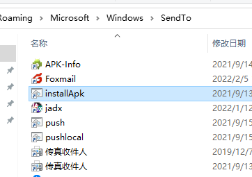
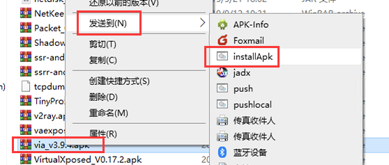

# Install-Apk
The installation apk tool on the window OS.
# Features
- Support for multiple devices
- Multi-adb process conflict handling
- Support Apk path contains special characters
- More(todo)
# Use
## Window SendTo menu
> Tested only window 10
- Create the `installApk.bat` file in the directory where `installApk.jar` is located and enter the following content:
```bat
java -jar %~dp0/InstallApk.jar %1

```
- `Win+R` input `shell:sendto` open SendTo folder & create installApk.bat shortcut in the folder\

- Test with any `.apk` file\
